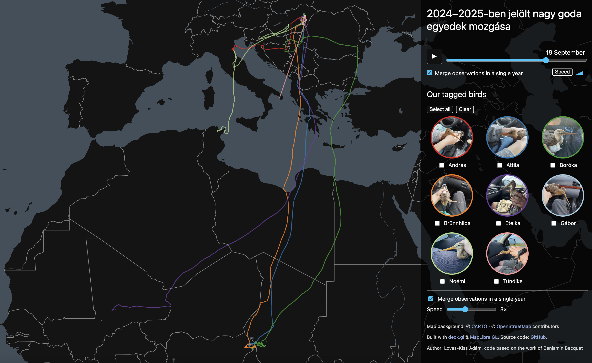

# Bird tracking map 🦅

An interactive web map showing the migration paths of some GPS-tracked birds between Northern/Eastern Europe and Africa.



Demo: https://bbecquet.github.io/bird-tracking/

Here is a blog post describing [why and how I created this project](https://bbecquet.net/articles/2022/05/bird-tracking-map/).

## Installing and running

Requirement: Node 18+.

```shell
npm install
```

then, to start a local dev server instance:

```shell
npm run dev
```

To build a standalone version:

```shell
npm run build
```

It will create a `build` directory with all files ready to be hosted anywhere. As everything happens on the client, it doesn't require any app server, just a plain old HTTP server.

⚠️ Please note that the data file (`birds.geojson`) is very large (~15 Mb) and needs to be downloaded by the client when the app starts. This means this server-less architecture will not scale well if you want to work with much larger data sets.


## Tech overview

Technically, this app is mostly a [Deck.gl](https://deck.gl) view, using a [MapLibre GL JS](https://maplibre.org/maplibre-gl-js/docs/) instance as mapping library, itself using a freely available basemap by [CARTO](https://carto.com). Everything is wrapped in a [React](https://react.dev) web app, as it's a natural environment for Deck.gl and it simplifies the management of UI.

The hard part (drawing and animating so many things) is handled by [Deck.gl's `TripsLayer`](https://deck.gl/docs/api-reference/geo-layers/trips-layer). Basically, it's a manager for lines with timestamped coordinates. You give it all the coordinates and times, a current timestamp that you update periodically, and voilà!

## Data

Source data is coming from the ["GPS tracking of Storks, Cranes and birds of prey, breeding in Northern and Eastern Europe" dataset](https://www.gbif.org/dataset/712dba38-74cc-4704-87c0-63d1bf8484bc) from the [Global Biodiversity Information Facility](https://www.gbif.org).

After some manual clean-up and simplification in QGIS, I use a Python script to heavily aggregate and transform raw CSV data into a [GeoJSON `FeatureCollection`](https://datatracker.ietf.org/doc/html/rfc7946#section-3.3) that is more fitted for JS manipulation. This script is in the `data` directory, as well as the latest CSV data I used. It takes the CSV file path as argument and prints the resulting GeoJSON on standard output.

So, to overwrite the current GeoJSON file (`public/birds.geosjon`), from the `data` directory:

```shell
python transform_birds.py ./clean_bird_migration.csv > ../public/birds.geojson
```

If you want to adapt the app to data formatted differently, you probably won't need this script. You just have to ensure the final GeoJSON format is right. Each GeoJSON `Feature` in the `FeatureCollection` should be:

```
{
    "id": <number>, // id of a single bird
    "type": "Feature",
    "geometry": {
        "type": "LineString",
        "coordinates": <number[][]> // lng/lat pairs for each coordinate of the path of the bird
    },
    "properties": {
        "times": <number[]>, // timestamps for each coordinate
        "species": <string> // the bird species, used to split birds into groups with different colors
    }
}
```

In doubt, look at the content of `birds.geojson`, it's pretty self-explanatory.

## License

MIT.
